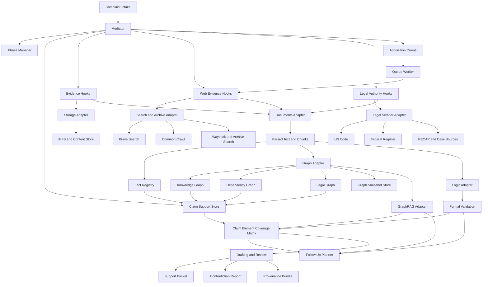
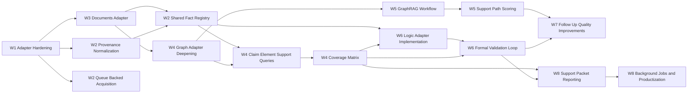

# IPFS Datasets Py Dependency Map

Date: 2026-03-11

## Purpose

This document turns the `ipfs_datasets_py` integration roadmap into an explicit dependency map.

Use it with:

- `docs/IPFS_DATASETS_PY_IMPROVEMENT_PLAN.md`
- `docs/IPFS_DATASETS_PY_EXECUTION_BACKLOG.md`
- `docs/IPFS_DATASETS_PY_CAPABILITY_MATRIX.md`

The goal is to show two things clearly:

1. how runtime information should flow through complaint-generator
2. what implementation order produces the fewest blockers and the highest-value early wins

This map should be read against the current repo state, not an earlier greenfield baseline. Complaint-generator already has persisted evidence and authority facts, queue-backed scraper execution, graph-support fallback summaries, and review payloads that expose coverage and follow-up summaries. The dependency question is therefore how to deepen those existing slices into a complete graph, retrieval, and reasoning system.

## Runtime Integration Map

## Runtime Notes

- `mediator/mediator.py` remains the orchestrator.
- `complaint_phases/` remains the canonical in-memory graph workflow.
- `integrations/ipfs_datasets/` remains the only production boundary to `ipfs_datasets_py`.
- long-running scraper acquisition should flow through claimed queue work rather than unconditional daemon execution.
- the shared case outputs that matter most are the existing fact registry, claim-support store, future persisted coverage matrix, and review packets.

## Responsibility Map

| Layer | Current Owner | Target Responsibility |
|---|---|---|
| Orchestration | `mediator/mediator.py` | phase progression, follow-up planning, review payloads |
| Storage and provenance | `mediator/evidence_hooks.py`, `integrations/ipfs_datasets/storage.py` | reproducible artifact storage and source lineage |
| Web acquisition | `mediator/web_evidence_hooks.py`, `integrations/ipfs_datasets/search.py` | search, fetch, archive, temporal metadata |
| Legal acquisition | `mediator/legal_authority_hooks.py`, `integrations/ipfs_datasets/legal.py` | authority retrieval, normalization, ranking |
| Parsing | `integrations/ipfs_datasets/documents.py` plus mediator ingestion hooks | text extraction, chunking, metadata, OCR fallback |
| Facts and support | `mediator/claim_support_hooks.py` plus the current fact registry substrate | claim-element support organization |
| Graph enrichment | `integrations/ipfs_datasets/graphs.py`, `complaint_phases/` | support edges, entity resolution, graph persistence |
| GraphRAG | `integrations/ipfs_datasets/graphrag.py` | ontology quality and support-path scoring |
| Logic and provers | `integrations/ipfs_datasets/logic.py` | proof gaps, contradiction checks, sufficiency validation |
| Queue-backed acquisition | `mediator/evidence_hooks.py`, `mediator/mediator.py`, `scripts/agentic_scraper_cli.py` | deferred worker execution and queue inspection |
| Review outputs | mediator reporting layer | support packet, contradiction report, provenance bundle |

## Implementation Dependency Map

## Why this sequence matters

### 1. Documents before graphs and logic

Graph and theorem-prover workflows need normalized text and chunk outputs. Without a shared parse contract, each hook would continue producing source-specific intermediate data and downstream integration would stay brittle.

### 2. Queue-backed acquisition before sustained scraper operations

The scraper worker should consume queued work rather than running indefinitely without demand. This keeps archival and evidence acquisition aligned with real follow-up tasks and avoids idle scraping that produces unreviewed noise.

### 3. Durable corpus and facts before proof

Formal validation should operate on grounded facts, not directly on raw artifacts or raw search results. The fact registry is the bridge between parsing and proof.

The current registry already spans evidence and authorities. The remaining dependency is to extend that substrate to archived pages, graph artifacts, and future predicate or validation records so proof workflows do not need to special-case source families.

### 4. Graph queries before review surfaces

Support packets and contradiction reports only become useful when they can enumerate provenance-linked support traces rather than summary counters alone.

### 5. GraphRAG after graph persistence

GraphRAG can add the most value once graph snapshots, entity resolution, and support-path queries exist. Before that, ontology scoring has little stable substrate to evaluate.

## Critical Interfaces

### Interface 1: Parse Contract

Producer:

- `integrations/ipfs_datasets/documents.py`

Consumers:

- `mediator/evidence_hooks.py`
- `mediator/web_evidence_hooks.py`
- `mediator/legal_authority_hooks.py`
- `integrations/ipfs_datasets/graphs.py`
- `integrations/ipfs_datasets/logic.py`

Minimum fields:

- parse status
- normalized text
- chunk list
- metadata summary
- provenance or transform lineage

### Interface 2: Fact Registry Contract

Producer:

- parsing plus extraction stages

Consumers:

- claim support hooks
- graph adapter
- logic adapter
- review reporting

Minimum fields:

- fact ID
- source artifact or authority reference
- claim element links
- text span or chunk origin
- confidence and provenance

### Interface 3: Coverage Matrix Contract

Producer:

- claim support hooks plus graph and logic outputs

Consumers:

- mediator review APIs
- follow-up planner
- drafting workflow

Minimum fields:

- claim element ID
- supporting artifacts
- supporting authorities
- supporting facts
- contradiction count
- latest validation state
- unresolved gap summary

## Current Blockers

These are the main blockers preventing deeper integration right now:

1. The shared `documents.py` adapter exists, but it is not yet the fully adopted parse contract across evidence, scraped pages, and legal authorities.
2. The graph adapter exists but does not yet provide robust persistence or support-query workflows.
3. The logic adapter exists but still returns placeholder `not_implemented` contracts.
4. The system already persists extracted facts across evidence and authority domains, but it does not yet expose one durable corpus contract across archived pages, graph artifacts, and future predicates.
5. The queue-backed acquisition model exists for scraper work, but it has not yet been generalized to other long-running acquisition or reasoning tasks.

## Recommended Immediate Build Path

1. Deepen `integrations/ipfs_datasets/documents.py`.
2. Route evidence, web evidence, and authority parsing through that adapter consistently.
3. Expand the shared fact registry linked to claim elements and source lineage into a broader durable corpus contract.
4. Expand `integrations/ipfs_datasets/graphs.py` to persist and query graph snapshots.
5. Expose claim-element support queries and coverage-matrix reporting from graph and fact data.
6. Add GraphRAG scoring and theorem-prover validation on top of that substrate.

## Delivery Milestones

| Milestone | Scope | Depends On | Primary Outcome |
|---|---|---|---|
| M0 | Adapter and capability hardening | current baseline only | stable runtime-mode reporting and no direct production import drift |
| M1 | Shared parse and corpus contract | M0 | evidence, archived pages, and authorities produce one normalized parse family |
| M2 | Persistent support and graph query plane | M1 | facts, graph snapshots, and claim-element support traces become queryable and reviewable |
| M3 | Support-quality and validation layer | M2 | GraphRAG scoring, contradiction checks, and proof-gap outputs become mediator-visible |
| M4 | Operator productization | M2 and M3 | dedicated support packets, dashboard surfaces, and async enrichment workflows |

## Milestone Notes

### M0: Adapter and capability hardening

- finish capability reporting cleanup
- remove remaining direct production imports of `ipfs_datasets_py`
- keep degraded-mode behavior explicit and testable

### M1: Shared parse and corpus contract

- make `documents.py` the canonical parse contract
- extend the existing fact registry to archived pages and future predicate-bearing artifacts
- standardize provenance, transform lineage, and chunk metadata

### M2: Persistent support and graph query plane

- turn graph fallbacks into persisted graph snapshot contracts
- deepen claim-support APIs into support-tracing queries
- introduce persisted coverage-matrix semantics for review and drafting readiness

### M3: Support-quality and validation layer

- integrate GraphRAG scoring into support strength and follow-up quality
- implement logic adapter wrappers and claim-type predicate templates
- surface contradiction and proof-gap outputs through mediator review flows

### M4: Operator productization

- deepen the existing review API into fuller support packets and contradiction views
- carry queue and enrichment status into operator-facing surfaces
- move long-running archive, graph, and validation jobs into explicit background workflows

## Definition of an Integrated End State

The `ipfs_datasets_py` integration should be considered fully mature when complaint-generator can:

- acquire legal and factual sources reproducibly
- archive and parse those sources consistently
- organize them into facts, support edges, and graph structures
- explain why a claim element is covered, partial, missing, or contradictory
- produce provenance-backed support packets for drafting and review
- do all of that in full, partial, and degraded runtime modes
