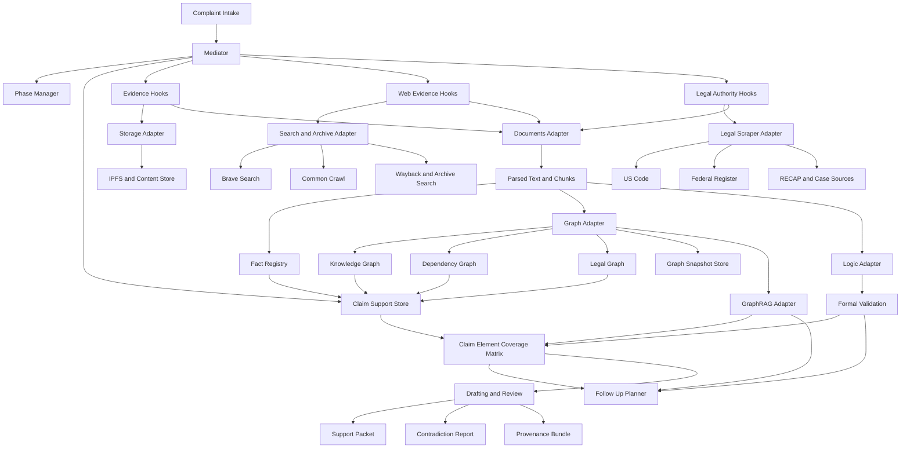
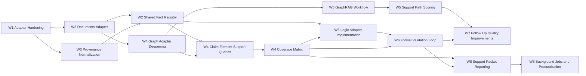

# IPFS Datasets Py Dependency Map

Date: 2026-03-11

## Purpose

This document turns the `ipfs_datasets_py` integration roadmap into an explicit dependency map.

Use it with:

- `docs/IPFS_DATASETS_PY_IMPROVEMENT_PLAN.md`
- `docs/IPFS_DATASETS_PY_EXECUTION_BACKLOG.md`
- `docs/IPFS_DATASETS_PY_CAPABILITY_MATRIX.md`

The goal is to show two things clearly:

1. how runtime information should flow through complaint-generator
2. what implementation order produces the fewest blockers and the highest-value early wins

## Runtime Integration Map

## Runtime Notes

- `mediator/mediator.py` remains the orchestrator.
- `complaint_phases/` remains the canonical in-memory graph workflow.
- `integrations/ipfs_datasets/` remains the only production boundary to `ipfs_datasets_py`.
- the shared case outputs that matter most are the fact registry, claim-support store, coverage matrix, and review packets.

## Responsibility Map

| Layer | Current Owner | Target Responsibility |
|---|---|---|
| Orchestration | `mediator/mediator.py` | phase progression, follow-up planning, review payloads |
| Storage and provenance | `mediator/evidence_hooks.py`, `integrations/ipfs_datasets/storage.py` | reproducible artifact storage and source lineage |
| Web acquisition | `mediator/web_evidence_hooks.py`, `integrations/ipfs_datasets/search.py` | search, fetch, archive, temporal metadata |
| Legal acquisition | `mediator/legal_authority_hooks.py`, `integrations/ipfs_datasets/legal.py` | authority retrieval, normalization, ranking |
| Parsing | planned `integrations/ipfs_datasets/documents.py` | text extraction, chunking, metadata, OCR fallback |
| Facts and support | `mediator/claim_support_hooks.py` plus planned fact registry | claim-element support organization |
| Graph enrichment | `integrations/ipfs_datasets/graphs.py`, `complaint_phases/` | support edges, entity resolution, graph persistence |
| GraphRAG | `integrations/ipfs_datasets/graphrag.py` | ontology quality and support-path scoring |
| Logic and provers | `integrations/ipfs_datasets/logic.py` | proof gaps, contradiction checks, sufficiency validation |
| Review outputs | mediator reporting layer | support packet, contradiction report, provenance bundle |

## Implementation Dependency Map

## Why this sequence matters

### 1. Documents before graphs and logic

Graph and theorem-prover workflows need normalized text and chunk outputs. Without a shared parse contract, each hook would continue producing source-specific intermediate data and downstream integration would stay brittle.

### 2. Facts before proof

Formal validation should operate on grounded facts, not directly on raw artifacts or raw search results. The fact registry is the bridge between parsing and proof.

### 3. Graph queries before review surfaces

Support packets and contradiction reports only become useful when they can enumerate provenance-linked support traces rather than summary counters alone.

### 4. GraphRAG after graph persistence

GraphRAG can add the most value once graph snapshots, entity resolution, and support-path queries exist. Before that, ontology scoring has little stable substrate to evaluate.

## Critical Interfaces

### Interface 1: Parse Contract

Producer:

- `integrations/ipfs_datasets/documents.py`

Consumers:

- `mediator/evidence_hooks.py`
- `mediator/web_evidence_hooks.py`
- `mediator/legal_authority_hooks.py`
- `integrations/ipfs_datasets/graphs.py`
- `integrations/ipfs_datasets/logic.py`

Minimum fields:

- parse status
- normalized text
- chunk list
- metadata summary
- provenance or transform lineage

### Interface 2: Fact Registry Contract

Producer:

- parsing plus extraction stages

Consumers:

- claim support hooks
- graph adapter
- logic adapter
- review reporting

Minimum fields:

- fact ID
- source artifact or authority reference
- claim element links
- text span or chunk origin
- confidence and provenance

### Interface 3: Coverage Matrix Contract

Producer:

- claim support hooks plus graph and logic outputs

Consumers:

- mediator review APIs
- follow-up planner
- drafting workflow

Minimum fields:

- claim element ID
- supporting artifacts
- supporting authorities
- supporting facts
- contradiction count
- latest validation state
- unresolved gap summary

## Current Blockers

These are the main blockers preventing deeper integration right now:

1. The shared `documents.py` adapter exists, but it is not yet the fully adopted parse contract across all ingestion paths.
2. The graph adapter exists but does not yet provide robust persistence or support-query workflows.
3. The logic adapter exists but still returns placeholder `not_implemented` contracts.
4. The system does not yet persist extracted facts as a first-class shared object.

## Recommended Immediate Build Path

1. Deepen `integrations/ipfs_datasets/documents.py`.
2. Route evidence and web evidence parsing through that adapter consistently.
3. Add a shared fact registry linked to claim elements.
4. Expand `integrations/ipfs_datasets/graphs.py` to persist and query graph snapshots.
5. Expose claim-element support queries from graph and fact data.
6. Add GraphRAG scoring and theorem-prover validation on top of that substrate.

## Definition of an Integrated End State

The `ipfs_datasets_py` integration should be considered fully mature when complaint-generator can:

- acquire legal and factual sources reproducibly
- archive and parse those sources consistently
- organize them into facts, support edges, and graph structures
- explain why a claim element is covered, partial, missing, or contradictory
- produce provenance-backed support packets for drafting and review
- do all of that in full, partial, and degraded runtime modes
