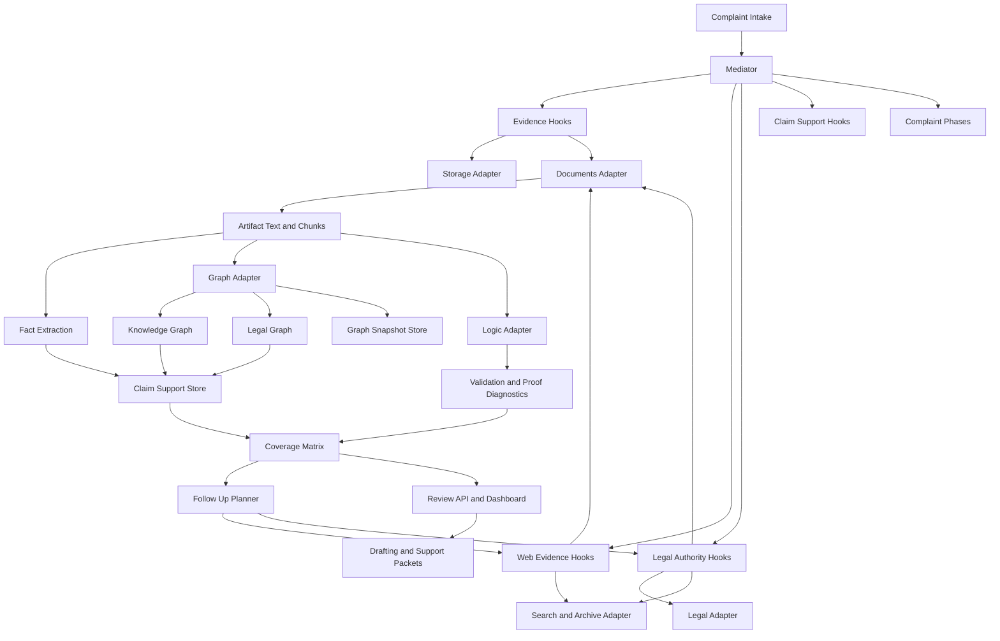

# IPFS Datasets Py Improvement Plan

Date: 2026-03-12

## Purpose

Define a comprehensive, implementation-oriented plan for how complaint-generator should use `ipfs_datasets_py` to improve:

- legal scraping and legal dataset search
- web search and web archiving
- evidence parsing for PDF, RTF, DOCX, HTML, and related formats
- graph-based information organization
- theorem-prover-backed validation and contradiction analysis
- retrieval, clustering, and follow-up planning
- operator review and drafting support

This plan is based on the repository as it exists now. It is not a greenfield architecture.

Use this document with:

- `docs/IPFS_DATASETS_PY_CAPABILITY_MATRIX.md`
- `docs/IPFS_DATASETS_PY_DEPENDENCY_MAP.md`
- `docs/IPFS_DATASETS_PY_INTEGRATION.md`
- `docs/LEGAL_AUTHORITY_RESEARCH.md`
- `docs/WEB_EVIDENCE_DISCOVERY.md`
- `docs/PAYLOAD_CONTRACTS.md`

## Executive Summary

Complaint-generator already has the right structural decision in place: `ipfs_datasets_py` is being consumed through the adapter boundary under `integrations/ipfs_datasets/`, and those adapters are already connected to the mediator, evidence ingestion, legal authority research, web evidence discovery, graph projection, and follow-up review flows.

The next step is not to add isolated features. The next step is to turn the current partial integration into one coherent legal knowledge plane.

That legal knowledge plane should let complaint-generator do six things well:

1. Acquire legal and factual material from current web, archives, and legal datasets.
2. Parse and normalize uploaded and discovered material into one shared artifact model.
3. Organize facts, authorities, events, entities, and timelines around claim elements.
4. Query graph-backed support paths instead of only counting raw support links.
5. Run theorem-style contradiction, sufficiency, and proof-gap checks on grounded facts.
6. Feed those results back into drafting, review, and follow-up planning.

The strongest improvement opportunity is the combination of three capabilities that already exist but are not yet fully unified:

- shared parse and provenance contracts
- graph-backed support organization
- proof-aware review and follow-up planning

The end state should be a complaint generator that can answer, for every claim element:

- what evidence supports it
- what legal authorities support it
- what statutes, administrative rules, agency guidance, and case-law authorities govern it in the relevant jurisdiction
- what archived or historical web records corroborate it
- what facts are duplicated, clustered, or contradictory
- what adverse authorities, limiting authorities, or stale authorities cut against it
- which supporting authorities are still good law or procedurally relevant enough to cite confidently
- what predicates are still missing for legal sufficiency
- what follow-up action is most valuable next

## Planning Assumptions

This plan assumes the following current-state facts are true in this checkout:

- complaint-generator remains the system orchestrator
- `complaint_phases/` remains the canonical in-memory workflow graph model
- all production `ipfs_datasets_py` usage should stay behind `integrations/ipfs_datasets/`
- the repo must support degraded mode when the submodule or optional upstream dependencies are unavailable
- evidence, legal authority, web evidence, graph support, review payloads, and follow-up history are already partly integrated and persisted

## Current Integration Surface

### Existing adapter boundary

The production integration surface already exists under `integrations/ipfs_datasets/`:

- `capabilities.py`
- `documents.py`
- `graphs.py`
- `graphrag.py`
- `legal.py`
- `loader.py`
- `logic.py`
- `mcp_gateway.py`
- `provenance.py`
- `scraper_daemon.py`
- `search.py`
- `storage.py`
- `types.py`
- `vector_store.py`

### Existing mediator consumers

The current repo already consumes those adapters from real complaint-generator workflows:

- `mediator/evidence_hooks.py`
- `mediator/web_evidence_hooks.py`
- `mediator/legal_authority_hooks.py`
- `mediator/claim_support_hooks.py`
- `mediator/mediator.py`

### Existing typed contracts

The most important typed contracts already in place are:

- `DocumentParseResult`
- `GraphSnapshotResult`
- `GraphSupportResult`

These should be treated as the base contracts for the next integration phase rather than replaced.

## Core Integration Rule

### Import discipline

Complaint-generator should not import `ipfs_datasets_py` directly from mediator, application, or complaint-phase code.

The allowed production pattern is:

1. complaint-generator code imports from `integrations.ipfs_datasets.*`
2. adapter modules import from upstream `ipfs_datasets_py.*`
3. adapters normalize upstream drift, async behavior, optional dependency gaps, and output shapes

This matters because the validated upstream package layout is not flat:

- legal scrapers live under `ipfs_datasets_py.processors.legal_scrapers.*`
- web archiving exports differ from older docs and code assumptions
- knowledge graph root imports are deprecated in favor of stable subpackages
- theorem-prover features span multiple nested logic packages

## Strategic Objective

Use `ipfs_datasets_py` to make complaint-generator a structured legal support system, not only a complaint drafting assistant.

That means the system must organize information around claim-element support, provenance, contradiction status, and proof state rather than around raw uploads, raw search results, or isolated tools.

## What Good Looks Like

The integration is successful when complaint-generator can do the following reliably:

### Evidence and document handling

- ingest PDF, RTF, DOCX, TXT, HTML, email-style text, and scraped page content through one parse contract
- preserve document-level provenance, parse summary, chunk lineage, and graph lineage
- extract reusable facts from both uploaded evidence and discovered materials
- attach each fact to claim elements, time windows, actors, and source spans

### Legal research

- search statutes, regulations, agency guidance, docket material, and case sources through normalized wrappers
- rank legal authorities by claim relevance, jurisdiction, procedural posture, and contradiction value
- persist parsed authority text and extracted facts where full text is available
- distinguish supportive authority from adverse or contradictory authority
- track whether a cited case or rule still appears usable after later authority treatment and citation-history checks

### Claim-aware legal corpus search and shepherdization

- search the legal corpus by claim element, defense theme, jurisdiction, forum, and time window instead of only by coarse claim type
- search not only for supporting law, but also for limiting law, preemption, exhaustion requirements, procedural bars, and adverse authority
- build authority-treatment records that capture whether a case, rule, or guidance document is supportive, adverse, distinguished, superseded, questioned, or merely procedural background
- surface citation-history and treatment uncertainty directly in review, drafting, and follow-up planning instead of burying it in raw search results
- use the graph and theorem-prover layers to connect facts to the specific legal propositions each authority supports or defeats

### Search and archiving

- search both current web and archival sources
- convert high-value discoveries into normalized case artifacts instead of transient search results
- preserve timestamps, archive URLs, fetch mode, and temporal lineage
- compare multiple versions of the same source when historical drift matters

### Graph organization

- project evidence, authorities, and archived pages into one support graph
- expose graph snapshots, entity resolution, and support-path tracing
- cluster duplicate or near-duplicate support so operators can see what is actually distinct
- support graph-backed coverage review by claim element

### Formal validation

- translate claim requirements into predicates and obligations
- translate facts and authority-derived rules into proof inputs
- identify contradiction, missing-premise, partial-proof, and unprovable states
- feed proof outcomes back into follow-up planning and drafting warnings

### Operator workflows

- show compact review summaries without losing drilldown access
- surface provenance bundles, support traces, contradiction packets, and follow-up history
- let operators see which tasks were broadened, retried, suppressed, or downgraded
- keep all of this available in both rich mode and degraded mode

## Target Architecture

## Capability-by-Capability Improvement Plan

## 1. Legal Scrapers and Legal Dataset Search

### Validated upstream capability

Use the legal adapter as the only boundary for:

- US Code
- Federal Register
- RECAP and case-source records
- future state and agency-specific scraper families

### Current strength

The repo already has legal authority search and storage hooks wired through the adapter layer, with support for authority persistence, parsed facts, and claim-support linking.

### Main gaps

- authority ranking remains relatively shallow
- state and agency coverage need expansion
- adverse authority handling is still limited
- full-text parsing is inconsistent across source families
- contradiction-aware authority analysis is not yet a first-class workflow
- administrative-rule and agency-guidance coverage is not yet organized as a first-class claim-element workflow
- there is no explicit shepherdization or citation-treatment layer for deciding whether case-law support is still reliable
- claim-element search is still too query-centric and not yet proposition-centric

### Improvement goals

1. Expand legal source coverage by jurisdiction and agency.
2. Normalize authority metadata so storage is queryable and rankable.
3. Parse available authority text through the same document contract used for evidence.
4. Extract authority facts, citations, obligations, exceptions, and procedural requirements.
5. Feed both supportive and adverse authority into claim-element validation.
6. Build a legal-corpus search workflow that can search for support and opposition for a fact pattern at the claim-element level.
7. Add a citation-treatment workflow so supportive authorities can be checked for negative history, limiting treatment, or procedural weakness before drafting.

### Concrete implementation work

- deepen `integrations/ipfs_datasets/legal.py` wrappers so async upstream calls are normalized into one sync-safe contract
- add richer normalized fields such as jurisdiction, authority level, date, source family, procedural role, and text availability
- route authority full text through `integrations/ipfs_datasets/documents.py`
- add claim-element-aware authority ranking in `mediator/legal_authority_hooks.py`
- store contradiction-oriented authority tags such as `supports`, `limits`, `distinguishes`, and `adverse`
- add normalized authority-family fields for `statute`, `regulation`, `administrative_rule`, `agency_guidance`, `case_law`, `docket_material`, and `secondary_source`
- extend `mediator/legal_authority_hooks.py` to generate search programs per claim element, required proof element, defense theme, and jurisdiction rather than one flat query bundle
- create an authority-treatment record in storage and review payloads that captures `treatment_type`, `treatment_source`, `treatment_confidence`, `treatment_date`, and `treatment_explanation`
- model citation-history edges in `complaint_phases/legal_graph.py` so a cited authority can be linked to later authorities that affirm, limit, distinguish, or undermine it
- add a drafting guardrail that suppresses or warns on authorities with unresolved negative treatment or stale procedural posture

### Success criteria

- every stored authority has normalized metadata and provenance
- full-text authorities produce parse summaries, chunks, facts, and graph metadata
- review flows can show top supportive and top adverse authority per claim element
- operators can see whether a case or administrative rule is still safe to rely on, questionable, or adverse to the current fact pattern

## 1A. Claim-aware Legal Corpus Search and Shepherdization

This is the missing workflow layer between legal acquisition and formal validation.

The complaint generator should not treat legal research as one search box that returns raw authorities. It should treat legal research as a structured claim-support workflow that answers five questions for each claim element:

1. What primary authority creates or defines the element?
2. What authority applies the element to facts similar to the current case?
3. What administrative rules, agency guidance, or procedural requirements condition the element?
4. What authority weakens, narrows, distinguishes, or defeats the element?
5. Which of the above authorities remain citeable after treatment and history checks?

### Proposed search program types

- element-definition search: locate statutes, rules, and core cases defining the element
- fact-pattern search: locate authorities with similar facts, actors, timing, and causation patterns
- procedural search: locate exhaustion, timeliness, venue, service, notice, and preservation requirements
- adverse-authority search: deliberately search for defenses, exceptions, safe harbors, preemption, immunity, and narrowing constructions
- treatment search: search for later cases, rule amendments, or guidance updates that affect whether a candidate authority is still reliable

### Proposed treatment model

Each authority candidate should be able to carry one or more treatment records:

- `supports`
- `adverse`
- `limits`
- `distinguishes`
- `questioned`
- `superseded`
- `procedural_only`
- `good_law_unconfirmed`

These should not initially require perfect external shepherdization coverage. The first milestone is to create a complaint-generator-native treatment model that can accept evidence from:

- later case-law search results
- regulatory amendment dates
- agency guidance revision history
- operator review notes
- theorem-prover contradiction outputs

### Implementation targets

- `integrations/ipfs_datasets/legal.py`: add normalized search wrappers for treatment-oriented queries and richer authority-type normalization
- `mediator/legal_authority_hooks.py`: generate and persist per-element search programs and treatment candidates
- `mediator/claim_support_hooks.py`: incorporate treatment state into support scoring, contradiction review, and follow-up planning
- `complaint_phases/legal_graph.py`: represent authority-to-authority treatment edges and proposition coverage edges
- `claim_support_review.py`: expose supportive, adverse, and treatment-summary counts in compact review payloads

### Acceptance criteria

- for a given claim element, the system can show both supportive and adverse authorities
- at least one treatment record can be attached to a stored authority without breaking degraded mode
- follow-up planning can prefer `find_better_authority` or `confirm_good_law` when support exists but treatment confidence is weak

## 2. Web Search and Web Archiving

### Validated upstream capability

Use `integrations/ipfs_datasets/search.py` and `integrations/ipfs_datasets/scraper_daemon.py` for:

- current-web search
- archive search
- archive capture
- multi-engine orchestration
- bounded scraper optimization loops

### Current strength

Complaint-generator already has:

- Brave-style current-web search
- Common Crawl search support
- archive sweeps and direct scraping
- persisted scraper runs, tactic telemetry, and queue-backed execution
- normalized web evidence storage alongside uploaded evidence

### Main gaps

- archive-first policy is not enforced for high-value sources
- temporal diffing is still weak
- duplicate public pages from multiple engines are not yet fully consolidated into one temporal source model
- not all web evidence is promoted into a durable case-corpus view with timeline semantics

### Improvement goals

1. Make archive-aware acquisition the default for high-value factual evidence.
2. Preserve source history, not only latest fetched text.
3. Cluster duplicate URLs, mirrors, and archived versions into one source family.
4. Connect discovered web evidence to claims, events, and timelines immediately after storage.

### Concrete implementation work

- add archive-first acquisition rules for government, employer, and notice-like URLs
- persist temporal metadata such as `observed_at`, `archived_at`, `capture_source`, and `version_of`
- extend scraper runs to output temporal-source clusters rather than flat result lists
- attach archived evidence directly to claim elements through fact extraction and graph projection
- add temporal contradiction checks for sources that changed over time

### Success criteria

- high-value web evidence has a current URL plus an archived representation when possible
- review surfaces can show version history and archive provenance
- duplicate pages from multiple engines collapse into one operator-facing source family

## 3. Document Parsing for PDF, RTF, DOCX, HTML, and Related Inputs

### Validated upstream capability

Use `integrations/ipfs_datasets/documents.py` as the single parse contract for:

- uploaded evidence
- scraped pages
- archived pages
- authority full text
- future attachments such as office docs, emails, or export bundles

### Current strength

The current evidence and web-evidence flows already persist parse summaries, chunks, and graph metadata, and the adapter exposes typed parse contracts.

### Main gaps

- not every source family is fully routed through one parse contract
- authority text parsing is not consistently aligned with evidence parsing
- OCR and fallback behavior need clearer operational rules
- chunking, span references, and parse lineage need to be standardized across all source types

### Improvement goals

1. Make `DocumentParseResult` the universal parse output.
2. Normalize bytes, text, and source metadata before downstream extraction.
3. Preserve chunk lineage and source spans for evidence citations.
4. Make parser output dependable enough for graph and theorem-prover use.

### Concrete implementation work

- require all ingestion hooks to emit a shared parse envelope built from `DocumentParseResult`
- standardize parse metadata fields such as content type, extraction mode, OCR usage, page count, chunk count, and warnings
- standardize chunk fields such as stable chunk ids, offsets, page numbers, and section labels
- add explicit parse quality flags so downstream logic can detect low-confidence text extraction
- ensure PDF, RTF, DOCX, HTML, TXT, and scraped page HTML all converge on one downstream schema

### Evidence analysis outcomes this unlocks

- uploaded evidence can be cited by chunk or page span
- graph extraction can use the same chunk ids across all source families
- theorem-prover inputs can point back to exact supporting text spans
- support review can explain which part of a document produced which fact or predicate

### Success criteria

- uploaded evidence and discovered sources produce identical downstream parse shapes
- legal authority full text can be parsed and chunked through the same contract
- downstream fact, graph, and proof records can all point back to parse spans

## 4. Graph Database and Knowledge Graph Usage

### Validated upstream capability

Use `integrations/ipfs_datasets/graphs.py` for graph extraction, persistence, support querying, and lineage while keeping `complaint_phases/` as the canonical decision graph surface.

### Current strength

The repo already has:

- graph extraction during evidence and authority ingestion
- graph projection into complaint-phase graphs
- typed graph snapshot and support-result contracts
- graph trace exposure in support links and review payloads
- graph-support fallback queries with duplicate and semantic cluster handling

### Main gaps

- there is no fully realized backing graph-store strategy for multi-artifact case graphs
- cross-document entity resolution is still shallow
- support-path querying remains more review-oriented than corpus-oriented
- graph snapshots are useful, but not yet a durable graph service layer

### Improvement goals

1. Turn graph metadata into a proper case graph plane.
2. Persist graph snapshots in a way that supports retrieval and lineage.
3. Resolve entities and events across uploads, authorities, and archived pages.
4. Use graph queries for support-path discovery, contradiction context, and drafting support.

### Concrete implementation work

- deepen `persist_graph_snapshot(...)` into a durable snapshot strategy with lineage and query handles
- add case-level entity resolution across evidence, authorities, and archived pages
- expose graph-path queries such as `artifact -> fact -> claim element -> authority`
- make graph queries available to review, follow-up planning, and support packet generation
- define graph backend tiers:
  - local fallback graph metadata only
  - DuckDB plus persisted snapshot references
  - optional external graph backend where available

### Success criteria

- every major source family can be projected into the same support graph
- review packets can show graph-backed support paths, not just counts
- duplicate sources and semantically similar facts cluster coherently at graph level

## 5. GraphRAG and Information Organization

### Validated upstream capability

Use `integrations/ipfs_datasets/graphrag.py` after the shared corpus and graph snapshot model are stable.

### Current strength

The adapter boundary already exists, and the upstream GraphRAG stack is validated. Complaint-generator also already has a strong support-review substrate where GraphRAG can eventually improve scoring and path prioritization.

### Main gaps

- ontology generation is not yet part of complaint workflows
- support-path scoring is not yet driven by GraphRAG
- graph quality and ontology refinement are not feeding follow-up planning yet

### Improvement goals

1. Build case-specific ontologies from complaint, evidence, and authorities.
2. Score support paths rather than individual records only.
3. Use ontology gaps to improve acquisition and follow-up planning.

### Concrete implementation work

- build ontology-generation workflows from parsed corpora and existing complaint-phase graphs
- validate ontologies and feed structural gaps into support review
- add support-path quality scoring to claim-element coverage
- use ontology-driven gap signals to improve search keywords and follow-up task ranking

### Success criteria

- graph review surfaces can show ontology-backed support-path confidence
- follow-up planning improves when ontology structure is weak or disconnected
- support packets can explain why one path is stronger than another

## 6. Theorem Provers, Logic, and Formal Validation

### Validated upstream capability

Use `integrations/ipfs_datasets/logic.py` as the only complaint-generator boundary for:

- FOL translation
- deontic translation
- TDFOL reasoning
- contradiction checks
- optional external prover bridges
- neuro-symbolic coordination

### Current strength

The current repo already has proof-aware decision traces, contradiction-aware validation states, reasoning diagnostics, and reasoning-aware follow-up planning. The system is no longer proof-blind.

### Main gaps

- logic adapter implementation is still shallower than the review model consuming it
- predicate templates are not yet consistently claim-type specific
- proof runs are not yet first-class persisted workflow objects
- rule extraction from authorities is still limited

### Improvement goals

1. Ground proof workflows in extracted facts and authority-derived rules.
2. Represent claim elements as explicit premises and obligations.
3. Distinguish missing support from missing logic from contradiction.
4. Make proof results reviewable, not just computable.

### Concrete implementation work

- implement non-placeholder logic adapter functions for contradiction and support checks
- define claim-type-specific predicate templates in complaint-analysis and claim-support layers
- extract rule candidates from legal authorities into deontic or rule-like forms
- persist validation runs with inputs, outputs, failed premises, and proof traces
- add optional prover tiers:
  - heuristic and internal reasoning only
  - symbolic internal proof checks
  - optional external prover integration for advanced validation

### Success criteria

- each claim element can report proof state and failed premises
- contradictions are grounded in specific facts, rules, or missing assumptions
- review APIs can display proof traces without exposing raw prover complexity

## 7. Vector Search and Hybrid Retrieval

### Role in the plan

Vector search is not the first milestone, but it becomes valuable once the parse and corpus contracts are stable.

### Improvement goals

- index artifact chunks, authority chunks, archived pages, and possibly fact summaries
- support hybrid retrieval using keyword, graph, and vector signals together
- improve recall for semantically similar evidence and authorities

### Concrete implementation work

- deepen `integrations/ipfs_datasets/vector_store.py` after chunk and metadata schemas are stable
- define one corpus index contract across evidence, authorities, and archives
- integrate hybrid retrieval into follow-up planning and support review

## 8. MCP Gateway and Tool Exposure

### Role in the plan

This should stay narrowly scoped. It is useful only where remote orchestration or tool exposure clearly improves operator workflows.

### Improvement goals

- expose only deliberate, review-safe tools
- avoid generic tool passthrough without provenance or security controls

## Shared Information Model

The complaint generator should organize information around these durable objects:

### 1. Artifact

A normalized source object for:

- uploaded evidence
- discovered page
- archived page
- authority text
- generated bundle or export

Minimum fields:

- durable id
- source family
- provenance
- storage handle or CID
- parse metadata
- graph metadata

### 2. Chunk

A stable, citeable text segment with offsets and lineage.

Minimum fields:

- chunk id
- artifact id
- offsets or page references
- text
- parse confidence and extraction mode

### 3. Fact

A normalized extracted proposition with provenance.

Minimum fields:

- fact id
- source artifact or authority id
- origin chunk or span
- normalized text
- confidence
- claim-element links

### 3A. Authority Record

A normalized legal source object for statutes, regulations, administrative rules, agency guidance, case law, docket material, and other authority-family records.

Minimum fields:

- authority id
- authority family and source family
- citation and title
- jurisdiction, forum, and precedential tier
- effective-date window or procedural posture
- provenance and text-availability metadata
- parse, chunk, and graph handles where full text exists

### 3B. Authority Treatment Edge

A durable citation-history or amendment-history edge that explains how one authority affects another authority or rule candidate.

Minimum fields:

- treatment edge id
- citing authority id
- cited authority id
- treatment label
- treatment confidence
- treatment source span or provenance reference
- temporal marker such as decision date, amendment date, or effective date

### 3C. Rule Candidate

A normalized legal proposition extracted from authority text for later claim-element matching and predicate construction.

Minimum fields:

- rule id
- authority id
- normalized rule text
- rule type such as element, defense, exception, remedy, or procedural prerequisite
- jurisdiction and temporal scope
- linked claim elements or predicate templates
- source span and extraction confidence

### 4. Support Edge

The join between a fact or authority and a claim element.

Minimum fields:

- claim element id
- support kind
- source record id
- provenance bundle
- graph trace
- validation status

### 5. Graph Snapshot

A persisted graph representation of one source or one case view.

Minimum fields:

- graph id
- snapshot status
- created versus reused
- source artifact ids
- lineage

### 6. Predicate and Validation Record

A structured reasoning object derived from facts and rules.

Minimum fields:

- predicate id
- claim element id
- source facts and rules
- proof state
- contradiction state
- failed premises

## Workflow-by-Workflow Integration Plan

| Workflow | Current Owner | `ipfs_datasets_py` role | Improvement target |
|---|---|---|---|
| Complaint intake | `complaint_analysis/*` | lightweight legal search, classification hints, initial graph extraction | better claim framing and intake questions |
| Evidence ingestion | `mediator/evidence_hooks.py` | parsing, storage, provenance, graph extraction | one parse contract and stronger fact extraction |
| Web discovery | `mediator/web_evidence_hooks.py` | search, archive, scrape, queue-backed acquisition | archive-first discovery and temporal evidence handling |
| Legal research | `mediator/legal_authority_hooks.py` | legal scrapers, archive search, authority normalization | deeper source coverage and contradiction-aware authority analysis |
| Legal corpus search and shepherdization | `mediator/legal_authority_hooks.py`, `mediator/claim_support_hooks.py` | treatment-oriented search, citation-history normalization, authority graph edges | support-and-against analysis plus good-law confidence per claim element |
| Support organization | `mediator/claim_support_hooks.py` | graph support, GraphRAG, logic diagnostics | claim-element support packets and graph-backed drilldown |
| Formal validation | `complaint_phases/neurosymbolic_matcher.py` | logic, provers, neuro-symbolic reasoning | grounded proof and contradiction workflows |
| Review and dashboard | review APIs and dashboard | compact summaries, provenance, graph, proof packets | operator workspace for support, contradictions, and history |
| Drafting | complaint generation path | support bundles, citations, proof warnings | filing-ready substantiation for each claim section |

## Recommended Delivery Phases

## Phase 0: Guardrails and import hygiene

Objective:

- keep the adapter boundary stable and explicit

Key work:

- eliminate or block new direct production imports of `ipfs_datasets_py`
- keep capability detection and degraded mode explicit
- document supported runtime tiers and feature flags

Primary files:

- `integrations/ipfs_datasets/capabilities.py`
- `integrations/ipfs_datasets/loader.py`
- CI and docs coverage

## Phase 1: Shared parse and corpus contract

Objective:

- make uploaded evidence, scraped pages, archived pages, and authority text flow through one parse model

Key work:

- finish adoption of `DocumentParseResult`
- standardize chunk lineage and parse metadata
- route authority text parsing through the same adapter
- add parse quality flags and fallback behavior

Primary files:

- `integrations/ipfs_datasets/documents.py`
- `integrations/ipfs_datasets/types.py`
- `mediator/evidence_hooks.py`
- `mediator/web_evidence_hooks.py`
- `mediator/legal_authority_hooks.py`

## Phase 2: Durable case corpus and support organization

Objective:

- expose one durable support corpus over evidence, authorities, archives, and extracted facts

Key work:

- unify fact registry behavior across source families
- normalize support edges and provenance bundles
- make support facts queryable by claim element and source family

Primary files:

- `mediator/claim_support_hooks.py`
- persistence layers in mediator hooks
- review payload builders

## Phase 2A: Claim-aware legal corpus search and shepherdization

Objective:

- make statutes, administrative rules, guidance, and case law searchable and reviewable as support-for or support-against evidence at the claim-element level

Key work:

- create per-element legal search programs
- add treatment-state persistence for authorities
- distinguish supportive, adverse, and procedurally relevant authorities
- extract rule candidates and procedural prerequisites from authority text into reusable claim-element support objects
- add fact-pattern-to-rule matching so the system can explain whether the current facts satisfy, partially satisfy, or miss a legal element
- add review and drafting warnings for unresolved negative treatment

Primary files:

- `integrations/ipfs_datasets/legal.py`
- `mediator/legal_authority_hooks.py`
- `mediator/claim_support_hooks.py`
- `complaint_phases/legal_graph.py`
- `claim_support_review.py`

## Phase 3: Graph persistence and support-path querying

Objective:

- upgrade graph metadata into a usable graph query plane

Key work:

- deepen snapshot persistence and lineage
- add cross-document entity resolution
- expose graph-backed support-path queries for review and drafting
- define optional graph backend tiers

Primary files:

- `integrations/ipfs_datasets/graphs.py`
- `complaint_phases/knowledge_graph.py`
- `complaint_phases/legal_graph.py`
- `mediator/mediator.py`

## Phase 4: GraphRAG-backed support scoring

Objective:

- use ontology and structure quality to improve coverage review and follow-up planning

Key work:

- ontology generation and validation
- support-path scoring
- ontology-gap feedback into acquisition planning

Primary files:

- `integrations/ipfs_datasets/graphrag.py`
- `mediator/claim_support_hooks.py`
- review and dashboard payloads

## Phase 5: Formal validation and theorem-prover workflows

Objective:

- make proof, contradiction, and failed-premise analysis first-class workflow objects

Key work:

- implement real logic adapter behavior
- create claim-type predicate templates
- persist proof runs and diagnostics
- integrate authority-derived rules into proof inputs

Primary files:

- `integrations/ipfs_datasets/logic.py`
- `complaint_phases/neurosymbolic_matcher.py`
- `mediator/claim_support_hooks.py`

## Phase 6: Operator productization and drafting integration

Objective:

- deliver review, support-packet, and drafting workflows that expose the new information model cleanly

Key work:

- contradiction review workspace
- provenance bundle and support packet generation
- timeline and archive drilldown
- drafting-time warnings and missing-premise notices

Primary files:

- review APIs and dashboard
- complaint generation and export flows

## Concrete File-Level Priorities

### Highest-value near-term files

- `integrations/ipfs_datasets/documents.py`
- `integrations/ipfs_datasets/graphs.py`
- `integrations/ipfs_datasets/legal.py`
- `integrations/ipfs_datasets/logic.py`
- `mediator/evidence_hooks.py`
- `mediator/web_evidence_hooks.py`
- `mediator/legal_authority_hooks.py`
- `mediator/claim_support_hooks.py`
- `claim_support_review.py`

### Why this order

1. Parsing quality determines downstream graph and proof quality.
2. Durable support organization is needed before advanced proof workflows become trustworthy.
3. GraphRAG and vector search only become useful when the corpus model is stable.
4. Operator surfaces should reflect mature data contracts rather than unstable intermediate representations.

## Operational Requirements

The integration must preserve three runtime tiers:

### Tier 1: degraded mode

- submodule absent or optional dependency unavailable
- complaint-generator still functions with limited acquisition and validation behavior

### Tier 2: local enriched mode

- parsing, graph extraction, local storage, and compact review work without advanced external services

### Tier 3: full enriched mode

- web acquisition, archive search, graph persistence, GraphRAG, and optional theorem-prover integrations are enabled

Each adapter should report capability status in a way that review and operations surfaces can expose clearly.

## Testing and Validation Plan

Each phase should add focused tests in the current style of the repo.

### Required validation categories

- adapter contract tests
- mediator hook integration tests
- review payload and dashboard tests
- degraded-mode tests
- persistence and lineage tests
- duplicate and semantic cluster tests
- proof-diagnostic and contradiction tests

### Minimum test outcomes for major milestones

- parsing changes must prove shape compatibility across evidence, web evidence, and legal authority flows
- graph changes must preserve review and follow-up payload contracts
- proof changes must preserve stable `validation_status` and `proof_diagnostics` surfaces
- legal research and web evidence flows must keep working when some upstream capabilities are missing

## Metrics for Success

Track these as operational and product metrics:

### Acquisition metrics

- authority coverage by claim type and jurisdiction
- authority coverage by claim element and authority family
- archive capture rate for high-value URLs
- percentage of discovered sources promoted into durable artifacts

### Parsing metrics

- parse success rate by format
- chunk coverage rate
- low-confidence parse rate

### Support organization metrics

- claim-element coverage rate
- average distinct fact count per claim element
- duplicate and semantic cluster reduction rate

### Validation metrics

- contradiction detection rate
- proof-gap rate by claim type
- percentage of follow-up tasks driven by reasoning versus missing support alone

### Legal treatment metrics

- percentage of cited authorities with treatment state recorded
- percentage of claim elements with both supportive and adverse authority coverage
- percentage of drafted authority citations marked safe, uncertain, or adverse
- percentage of rule candidates linked to a claim element or predicate template

### Operator metrics

- time to resolve contradiction review
- percentage of review packets with provenance drilldown available
- operator acceptance rate of suggested follow-up tasks

## Major Risks and Mitigations

| Risk | Why it matters | Mitigation |
|---|---|---|
| Direct upstream imports leak into production code | fragile package coupling | enforce adapter-only discipline |
| Parser drift across source families | downstream graph and proof instability | one shared parse contract and compatibility tests |
| Graph persistence outruns data quality | false confidence in graph-backed support | gate graph use on parse quality and provenance completeness |
| Proof workflows overfit weak facts | misleading contradiction or sufficiency outputs | require grounded facts, explicit confidence, and operator-facing diagnostics |
| Archive and scraper acquisition generate too much noise | review burden increases | queue-backed acquisition, ranking, clustering, and archive-first heuristics |
| Optional upstream capabilities are unavailable | broken workflows in some environments | maintain explicit degraded mode and capability reporting |

## Recommended Immediate Next Batch

If this plan is executed incrementally, the highest-value next batch is:

1. Finish the shared parse contract across evidence, web evidence, and authority text.
2. Expand the durable corpus model so archived pages and authority facts are first-class support sources.
3. Add claim-element legal corpus search programs and first-pass authority treatment records for statutes, administrative rules, and case law.
4. Deepen graph snapshot persistence and support-path queries.
5. Implement the logic adapter enough to replace placeholder proof behavior with grounded contradiction and failed-premise outputs.
6. Add operator support packets that combine provenance, graph trace, authority support, authority treatment, and proof status per claim element.

## Summary

The complaint-generator repository is already beyond the question of whether `ipfs_datasets_py` should be integrated. It is integrated.

The real question is how to finish the job in a way that improves legal search, evidence analysis, information organization, graph reasoning, and formal validation without destabilizing production workflows.

The answer is:

- keep `integrations/ipfs_datasets/` as the only upstream boundary
- unify all acquired material under one artifact, chunk, fact, graph, and predicate model
- treat graph and theorem-prover features as support-quality layers over grounded parsed material
- push results back into review, follow-up planning, and drafting instead of leaving them isolated in adapters

If this plan is followed, complaint-generator can evolve from a complaint drafting workflow with helpful retrieval hooks into a case-support system that is provenance-aware, archive-aware, graph-aware, and proof-aware.